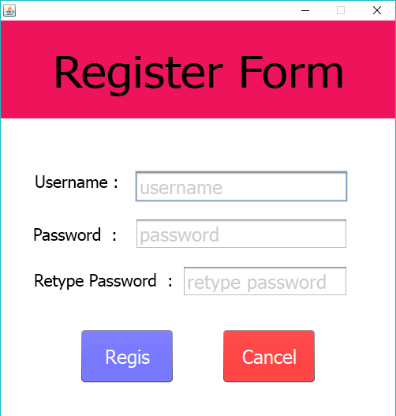

# My Hilo Game
The Hilo game application is a gambling game created by a student at Kasetsart University in the 
Software and Knowledge Engineering program, which this application is a project as part of OOP course for first semester of Kasetsart University.

**Table of Contents**
- [What is Hilo?](#what-is-hilo-game)
- [Main Features](#main-features)
- [What is on this game](#play-the-game)
- [How to get this game](#get-this-game)
- [Why we make this game](#why-make-this-game)

## What is Hilo Game
The main point of Hilo is the player guesses High or Low; win or loses depends on the outcome of the number but 
in the future we will add more games to this application keeping the concept of High and Low. The new features that we add are similar to HiLow so you have more choices to play on this application.
   
   
    
 
 ## Main Features
 - [**Login Form**](#login) with remembers an account User, Password and Amount of the Money in game
 - [**Register Form**](#register) to create a new account for playing this game
 - [**Main Page**](#choosing-game) This page is for User to choose what to play
 - [**Hilo Dice Game**](#hilo-dice-game) is a page of game that will play by rolling three dice
 - [**Hilo Card Game**](#hilo-card-game) is a page of User to play card game with bot
 
 
 ## Play the Game
 ### Login
 Login with your own account for remembering User and amount of the money that you have play on this application..
 
   
 ### Register
 Register for create new account for palying on this application.
 Every time you have register on this application your account will got money on the account 2000 bath.
    
   
 ### Choosing Game
 You can choose the game to play with all the game is keeping concept High and Low.
 
   
 ### Hilo Dice Game
 This is a Hilo dices game with you can choose the face of dice to bet on it which need one of the three dice to face up what you choosing.
 Also have feature to choose witch depend on how many faces of dice need to face up the same as you bet.
 
   
   
   
   
  ### Hilo Card Game
  This is a Hilo card game with need to play card game with bot. You and bot will get one card (cannot see
  each other). You have ability to choose new card, let bot get a new card or both get new card. Each ability
  will count that you can use on each round. To win this game you need to have card, witch have a bigger card point than 
  bot.
  
  
  
    
## Get This Game
#### Download

Click [here](https://github.com/darmonlyone/MyHighLowGame/releases) to get the latest version of this application.

### Installation

To run the program you need:
* Oracle Java Runtime Environment (JRE) version 8 or newer
* jbcrypt.jar, AbsoluteLayout.jar and beansbinding-1.2.1.jar (in lib diirectory)
* FileLoader package (in top directory)
* MyHiLO.jar (in top directory)

Download these files to a directory on your computer. Strongly recommended that you use a directory **without any spaces in the path**.

**TODO** Put all the files the user needs in a directory named "dist"

#### Using Apple
   **[Download](https://github.com/darmonlyone/MyHighLowGame/releases)** >> *HighLow.zip*
   - Extract HighLow.zip file 
   - **Run** MyHiLO.jar
     
#### Using Windows
   **[Download](https://github.com/darmonlyone/MyHighLowGame/releases)** >> *HighLow_win.rar*   
   - Extract HighLow_win.rar file 
   - **Run** MyHiLO.exe
     
#### Any Operating System
Suppose you have downloaded the files to a directory named /home/username/games. Then add these files to classpath and run the main class of game using:
```shell
cmd>  java -cp '/home/username/games/*' myhilo.MainRun
```
You must write the directory (path) in quotes to prevent processing of "\*" by the shell interpretter.

## Why Make This Game
The application is made for an OOP project in part of Software and Knowledge Engineering (Kasetsart University). We make
the application to show how much we can do from learning in this course. We use many things from this course to write the
application like using an Array, ArrayList, Method, Class, FileLoader, FileWriter or even a basic programing. **We hope
very much for your guy to enjoy this application.**

## Contributors
- [**Manusporn Fukkham**](https://github.com/darmonlyone)
